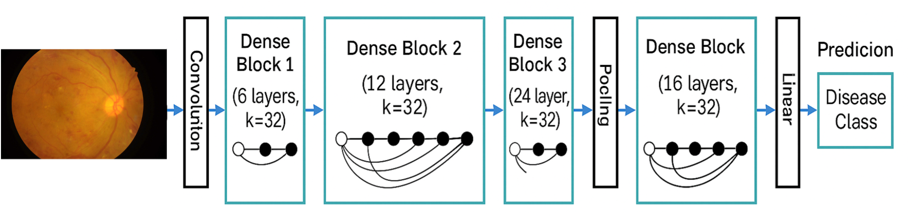

# 🧠 Retina Disease Detection — DenseNet-121

## 📌 Overview

This project implements **DenseNet-121**, a deep convolutional neural network, for **retinal disease detection and classification** using a real-world fundus image dataset.  
The goal is to automatically identify retinal diseases by analyzing fundus photographs and classifying them into distinct disease categories.

### 🧠 About DenseNet-121
DenseNet-121 (Dense Convolutional Network) was introduced by **Huang et al. (2017)**.  
Unlike conventional CNNs, DenseNet connects **each layer to every other layer** in a feed-forward manner, encouraging **feature reuse** and efficient **gradient flow**.  
This architecture achieves strong accuracy with fewer parameters, making it suitable for medical imaging tasks such as retinal disease detection.

In this project, **DenseNet-121 pretrained on ImageNet** was fine-tuned on the retinal dataset using **Focal Loss**, **weighted class balancing**, and **label smoothing** to address class imbalance and improve generalization.

---

## 🧩 Model Architecture

The following diagram shows the **DenseNet-121 model architecture** used for retinal disease classification:



Each *Dense Block* consists of multiple convolutional layers that are densely connected to encourage feature reuse, followed by *transition layers* that perform convolution and pooling to reduce dimensions before classification.

---

## 📊 Dataset Details

**Dataset:** [Retinal Disease Detection (Kaggle)](https://www.kaggle.com/datasets/mohamedabdalkader/retinal-disease-detection)

A total of **2,257 retinal images** were used in this study, divided into:
- **Training:** 1,578 images  
- **Validation:** 340 images  
- **Testing:** 339 images  

Each image corresponds to a specific **retinopathy class (0 – 4)** representing increasing severity levels.

---

## 🧱 Project Structure
```
RetinaScan_DL-Assignment/
├── data/
│   ├── train.csv
│   ├── valid.csv
│   ├── test.csv
│   └── Diabetic Retinopathy/
│
├── Densenet121/
│   ├── src/
│   │   ├── dataset.py
│   │   ├── evaluate.py
│   │   ├── losses.py
│   │   ├── make_splits.py
│   │   ├── model_densenet121.py
│   │   ├── plot_compare.py
│   │   ├── plot_compare_eval.py
│   │   ├── plot_metrics.py
│   │   ├── train.py
│   │   ├── transforms.py
│   │   └── utils.py
│   │
│   ├── runs/
│   │   ├── d121_224_focal/
│   │   ├── d121_320_focal/
│   │   └── d121_448_focal/
│   │
│   ├── README.md
│   ├── requirements.txt
│   └── .gitignore
│
└── report/
    ├── figures/
    └── results/
```

---

## ⚙️ Environment Setup

```bash
python3 -m venv .venv
source .venv/bin/activate        # Windows: .venv\Scripts\activate
pip install --upgrade pip
pip install -r requirements.txt
```

On macOS (Apple Silicon):
```bash
export PYTORCH_ENABLE_MPS_FALLBACK=1
```

---

## 🧩 Model Training

Example command used for best-performing model:

```bash
python src/train.py   --pretrained   --train_csv data/train.csv --val_csv data/valid.csv   --out_dir runs/d121_448_focal   --epochs 20 --patience 6 --freeze_epochs 1   --batch_size 16 --img_size 448   --head_lr 1e-3 --backbone_lr 1e-4 --lr 1e-4   --weight_decay 1e-4   --focal --weighted_loss --label_smoothing 0.05
```

### 🔧 Key Techniques
- **Pretrained DenseNet-121** (ImageNet initialization)  
- **Focal Loss** to emphasize difficult samples  
- **WeightedRandomSampler** to balance class frequencies  
- **Label smoothing (0.05)** to improve calibration  
- **CosineAnnealingLR** for smooth learning-rate decay  
- **Mixed Precision (MPS)** acceleration on Apple GPU  

---

## 🧠 Evaluation

After training, evaluate the model using:

```bash
python src/evaluate.py   --checkpoint runs/d121_448_focal/best.pt   --csv data/test.csv   --img_size 448   --batch_size 64   --tta   --save_preds   --save_probs
```

Outputs:
- Classification report (precision, recall, F1, accuracy)  
- Confusion matrix (`cm_eval.npy` & `confusion_matrix.png`)  
- Saved predictions (`preds_eval.csv`)

---

## 📊 Final Experimental Results

| Input Size | Accuracy | Macro-F1 | Notes |
|-------------|-----------|----------|-------|
| **224×224** | 53.39% | 0.5154 | Baseline (pretrained DenseNet-121) |
| **320×320** | 65.78% | 0.5516 | Better balance between detail and speed |
| **448×448** | **67.55%** | **0.5752** | Best performing configuration |

The **448×448 model** achieved the highest overall performance with improved precision on minority classes, demonstrating the benefit of higher-resolution inputs and advanced loss balancing techniques.

---

## 📈 Visualization

You can generate accuracy, loss, and F1-score curves for each run using:

```bash
python src/plot_metrics.py --run_dir runs/d121_448_focal
```

This saves:
- `loss_curve.png`
- `acc_curve.png`
- `f1_curve.png`
- `confusion_matrix.png`

---

## 🔍 Key Insights
- **Higher input resolutions (448×448)** improved disease localization and texture discrimination.
- **Focal Loss** helped mitigate the effects of class imbalance by emphasizing rare disease samples.
- **Pretraining** significantly improved convergence speed and accuracy compared to training from scratch.
- Further improvements could involve:
  - Fine-tuning more epochs (40-60)
  - Using **MixUp** or **CutMix** augmentation
  - Applying **Grad-CAM** for model interpretability

---

## 🧾 References
- Huang, G., Liu, Z., Van Der Maaten, L., & Weinberger, K. Q. (2017). *Densely Connected Convolutional Networks*.  
  Proceedings of the IEEE Conference on Computer Vision and Pattern Recognition (CVPR), 4700–4708.  
- [Kaggle Dataset: Retinal Disease Detection](https://www.kaggle.com/datasets/mohamedabdalkader/retinal-disease-detection)

---

## 👤 Author
**Pradicksha Pradeepraj**  
BSc (Hons) in Information Technology Specialized in Software Engineering— SLIIT  
Year 4, Semester 1 — Deep Learning (SE4050)  
**Algorithm Used:** DenseNet-121  
**Framework:** PyTorch  
**Device:** Apple M-Series GPU (MPS)
