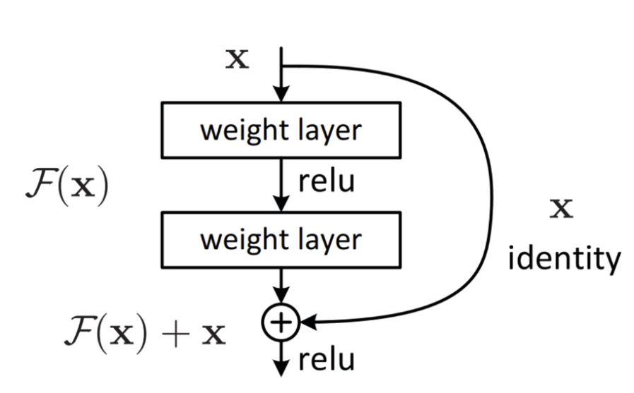

# 👁️‍🗨️ RetinaScan — ResNet18 for Retinal Disease Detection

> **Supervised multi-task CNN** for fundus images: **Diabetic Retinopathy grade (5‑class)** + **Macular Edema risk (binary)** using **ResNet18 + transfer learning**.
<p align="center">
  <a href="https://www.python.org/"></a>
  <a href="https://pytorch.org/"></a>
  
  
</p>
<p align="center">
  
</p>

---
## 🔍 Dataset

- **Source:** Kaggle — *Retinal Disease Detection* : https://www.kaggle.com/datasets/mohamedabdalkader/retinal-disease-detection  
- **Splits:** `train/`, `valid/`, `test/` with CSV annotations  
- **Labels:**
  - **Retinopathy Grade (0–4):** 0=Normal, 1=Mild, 2=Moderate, 3=Severe, 4=Proliferative  
  - **Macular Edema Risk (0/1):** 0=No Risk, 1=At Risk  
---

## 🧱 Project Structure

```
RetinaScan_Dl-Assignment/
├── configs/
│   └── resnet18.yaml
├── scripts/
│   ├── train.py                  
│   ├── make_report.py            
│   ├── gradcam.py               
│   ├── visualize_curves.py       
│   ├── visualize_like_paper.py   
│   ├── visualize_like_paper_plus_cm.py 
│   └── export_series_csv.py    
├── src/
│   ├── config.py
│   ├── datasets/retina.py
│   ├── models/resnet18_multitask.py
│   └── engine/
│       ├── trainer.py
│       └── metrics.py
└── outputs/
    └── retina-resnet18-YYYYMMDD-HHMMSS/
        ├── history.json
        ├── loss_curve.png, acc_curve.png, f1_curve.png, auc_curve.png
        ├── training_curves.png
        ├── final_split_compare.png
        ├── report_train/ 
        └── report_test/
```

---

## ⚙️ Setup

```bash
# 1) create env (Windows PowerShell shown)
python -m venv .venv
.\.venv\Scripts\activate

# 2) install deps
pip install -r requirements.txt
# (or)
pip install torch torchvision torchaudio --index-url https://download.pytorch.org/whl/cu121
pip install numpy matplotlib seaborn scikit-learn pandas pyyaml opencv-python tqdm

# 3) configure paths (configs/resnet18.yaml)
 data_dir: path to Kaggle dataset root
 columns:  Image name / Retinopathy grade / Risk of macular edema
```

---

## 🚀 Training

```bash
python scripts/train.py
```

Artifacts appear under `outputs/retina-resnet18-*/`.  
Best checkpoint is saved as `best.pt` (by **macro‑F1**) and history as `history.json`.

> I use **transfer learning**: ImageNet‑pretrained ResNet18 backbone + two heads  
(softmax for grade, sigmoid for edema).

---

## 📊 Results

| Split | Grade Accuracy | Grade Macro-F1 | Edema ROC-AUC |
|:------|:---------------:|:---------------:|:--------------:|
| **Train** | 76.79% | 0.7750 | 0.9997 |
| **Validation** | 66.96% | 0.5910 | 0.9760 |
| **Test** | 66.86% | 0.5829 | 0.9875 |

---

## 🖼️ Visualizations

- **Curves:** `loss_curve.png`, `acc_curve.png`, `f1_curve.png`, `auc_curve.png`  
- **Confusion Matrices & ROC:** in `report_test/` (and `report_train/`)

Generate all plots:

```bash
# pick latest run (PowerShell)
$run = Get-ChildItem .\outputs -Directory | Where-Object { $_.Name -like 'retina-resnet18-*' } | Sort-Object LastWriteTime -Descending | Select-Object -First 1

# per-split reports (create JSON/TXT/PNGs)
python scripts/make_report.py --cfg configs/resnet18.yaml --ckpt "$($run.FullName)\best.pt" --split test
python scripts/make_report.py --cfg configs/resnet18.yaml --ckpt "$($run.FullName)\best.pt" --split train  

# panels
python scripts/visualize_like_paper.py --run "$($run.FullName)" --smooth 0

# export per-epoch series to CSV (for Excel)
python scripts/export_series_csv.py --history "$($run.FullName)\history.json"
```

---

## 🔥 Grad‑CAM (qualitative)

```bash
python scripts/gradcam.py --cfg configs/resnet18.yaml --ckpt "$($run.FullName)\best.pt" --split valid --num 12
```

## 🧪 Reproducibility & Notes

- **Seeded training** via `config.seed`.
- **Class imbalance** handled with optional **class weights** (`scripts/compute_class_weights.py`).
- **Early stopping** monitors **macro‑F1** on validation.
- **Transfer learning**: freeze/unfreeze controlled in `resnet18_multitask.py` (default: pretrained backbone, trainable heads).

---

## 🔮 Future improvements:
- Class‑balanced sampling / focal loss
- Higher‑resolution crops; CLAHE fundus normalization
- MixUp/CutMix; RandAugment; TTA at test time
- Ensembling (ResNet34/50, EfficientNet‑B0)

---

## 🐰 Author
- Gamage S S J
- IT22607232
- Contribution: ResNET18_Model

