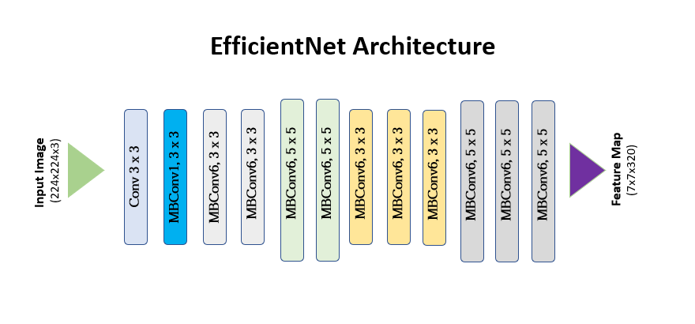

# 👁️ Retina DR & DME Classifier — EfficientNet-B0 (TF/Keras)

 **Multi-task deep learning system** for retinal fundus analysis — jointly predicting:
 - 🩸 **Diabetic Retinopathy grade** (5-class: 0–4)  
 - 🌊 **Macular Edema risk** (binary: no edema / edema)  

 Powered by **EfficientNet-B0** and **two-stage fine-tuning**, this model brings efficient transfer learning, stable convergence, and visual explainability through **Grad-CAMs**.

<p align="center">
  <a href="https://www.python.org/"></a>
  <a href="https://www.tensorflow.org/"></a>
  
  
</p>
<p align="center">
  
</p>

---

## 🔍 Dataset

- **Source:** [Kaggle — Retinal Disease Detection](https://www.kaggle.com/datasets/mohamedabdalkader/retinal-disease-detection)  
- **Structure:** `train/`, `valid/`, `test/` with CSV annotations  
- **Labels:**
  - **Retinopathy Grade (0–4):** 0 = Normal | 1 = Mild | 2 = Moderate | 3 = Severe | 4 = Proliferative  
  - **Macular Edema Risk (0/1):** 0 = No Risk | 1 = At Risk  

---

## 🗂️ Project Structure (key files)

```
retina-effnetb0/
├─ configs/
│  └─ efficientnet_b0.yaml
├─ data_preprocessed/
├─ runs/
│  └─ effnet_b0/
│     ├─ best.keras
│     ├─ history.csv
│     ├─ plots/
│     └─ reports/
├─ scripts/
│  ├─ preprocess_images.py
│  ├─ train.py
│  └─ evaluate_and_viz.py
└─ src/
   ├─ config.py
   ├─ data/tf_dataset.py
   ├─ models/tf_efficientnet_b0.py
   └─ train/tf_trainer.py
```

---

## ⚙️ Setup

### Environment
- **Python** ≥ 3.10  
- **TensorFlow** 2.16 + `tf-keras` backend  
- Recommended: virtual environment

### powershell
``` 
python -m venv .venv
.\.venv\Scripts\Activate.ps1
python -m pip install --upgrade pip setuptools wheel
pip install tensorflow==2.16.2 tf-keras==2.16.0 numpy==1.26.4 pandas scikit-learn scipy `
           opencv-python albumentations matplotlib seaborn pyyaml tqdm
```

---

## 🧮 Data & Preprocessing

Run preprocessing to resize and clean images before training:
```bash
python scripts/preprocess_images.py --data_root data --out_root data_preprocessed --size 380
```

`configs/efficientnet_b0.yaml` should then reference the preprocessed paths:

```yaml
paths:
  data_root: data_preprocessed
  train_csv: data_preprocessed/train/annotations_balanced.csv
  valid_csv: data_preprocessed/valid/annotations.csv
  test_csv:  data_preprocessed/test/annotations.csv
```

---

## 🚀 Training — Two-Stage Fine-Tuning

```bash
python scripts/train.py --config configs/efficientnet_b0.yaml
```

**Stage 1:** Freeze EfficientNet-B0 backbone, train task-specific heads.  
**Stage 2:** Unfreeze ~60 % of backbone, lower LR, fine-tune deeper layers for domain adaptation.

**Core hyperparams (YAML):**
```yaml
model:
  input_shape: [380, 380, 3]
  dropout: 0.4
  loss_weights: { grade: 0.6, edema: 0.4 }

train:
  batch_size: 16
  epochs_stage1: 10
  epochs_stage2: 30
  base_lr_stage1: 1e-4
  base_lr_stage2: 1e-5
  unfreeze_ratio: 0.6
  augment: true
  seed: 42
```

🧠 **Regularization:** Dropout + L2 (heads)  
🧩 **Early Stopping:** tuned patience for longer stage-2 convergence

---

## 📊 Results

| Split | Grade Accuracy | Grade Macro-F1 | Edema Accuracy | Edema Macro-F1 | Edema ROC-AUC |
|:------|:--------------:|:--------------:|:--------------:|:--------------:|:--------------:|
| **Train** | **68.50%** | **0.528** | **91.30%** | **0.913** | **0.967** |
| **Validation** | **64.60%** | **0.485** | **83.80%** | **0.782** | **0.940** |
| **Test** | **64.80%** | **0.430** | **90.50%** | **0.866** | **0.972** |

---

## 🧩 Observations

- Grade classification shows consistent performance across splits (~65% accuracy), suggesting good generalization.

- Edema detection performs strongly (ROC-AUC ≈ 0.97, macro-F1 ≈ 0.86 on test), indicating excellent sensitivity–specificity balance.

- The small drop from train → test confirms low overfitting and a stable model

---

## 🖼️ Visuals & Explainability

```bash
python scripts/evaluate_and_viz.py --config configs/efficientnet_b0.yaml --split valid --samples_for_gradcam 12
```

**Outputs:**  
- Confusion matrices (`plots/cm_grade_valid.png`)  
- ROC curves (`plots/roc_edema_valid.png`)  
- Training curves (`plots/training_curves.png`)  
- Grad-CAM overlays (`plots/gradcam_valid_grade/*.png`)  

---

## 🧠 Overfitting Control & Regularization

- **Two-stage fine-tuning** → avoids early overfitting on small datasets.  
- **Dropout + L2** → generalization boost.  
- **Balanced CSVs / class weights** → handle label imbalance.  
- **Early Stopping** → tuned patience for smoother late-stage improvements.  
- **Augmentation** → on-the-fly `albumentations`: random crop, flip, rotate, color jitter.

---

## 🚧 Future Improvements

| Area | Potential Upgrade |
|:-----|:------------------|
| **Loss functions** | Try **Focal Loss** or **Label Smoothing** for imbalanced DR classes. |
| **Architecture** | Experiment with **EfficientNet-B3/B4**, or **ConvNeXt-Tiny** for richer representations. |
| **Training tricks** | Enable **learning-rate warmup**, **cosine decay**, or **Lookahead optimizer**. |
| **Inference** | Add **Test-Time Augmentation (TTA)** and **ensembling** across EfficientNet variants. |
| **Deployment** | Convert model to **TF-Lite** or **ONNX** for edge inference (mobile ophthalmology tools). |

---

## 🔎 Reproducibility

- All seeds and configs logged under `runs/effnet_b0/config.yaml`
- Deterministic augmentations (seed = 42)  
- Compatible with both CPU and GPU (mixed precision optional)  

---

## 🧑‍💻 Author

- **Nimes R H R**  
- **IT22577160**
- **Contribution: EfficientNet-B0 Model Implementation & Analysis**  